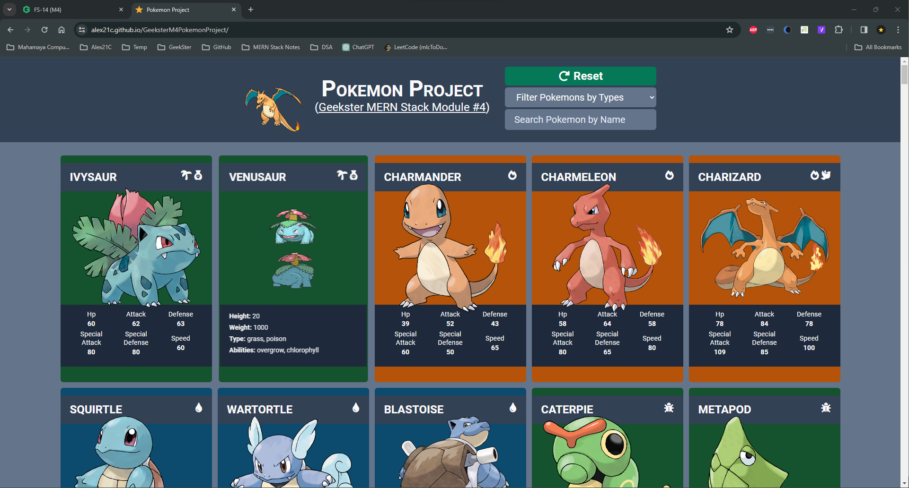

# Pokemon Project (Geekster MERN Stack Module 4)

<!--  -->

# Tech. Stack Used:
+ [MVC Framework](https://en.wikipedia.org/wiki/Model%E2%80%93view%E2%80%93controller)
+ [FetchAPI](https://developer.mozilla.org/en-US/docs/Web/API/Fetch_API)
+ [GSAP Javascript Animation Library](https://gsap.com/)
+ [HTML5](https://en.wikipedia.org/wiki/HTML5)
+ [CSS3](https://en.wikipedia.org/wiki/CSS)
+ [Tailwind CSS](https://tailwindcss.com/)
+ [JavaScript ES6](https://en.wikipedia.org/wiki/JavaScript)
+ [Font Awesome](https://fontawesome.com/icons)
+ [Google Fonts](https://fonts.google.com/)
+ [Git](https://en.wikipedia.org/wiki/Git)
+ [GitHub](https://github.com/)
+ [VS Code](https://code.visualstudio.com/)

# Hosted Version of the Project:
[Geekster M4 Project&mdash;Pokemon](https://alex21c.github.io/GeeksterM4PokemonProject/)

# Author
[Abhishek kumar](https://www.linkedin.com/in/alex21c/), ([Geekster](https://geekster.in/) MERN Stack FS-14 Batch)
